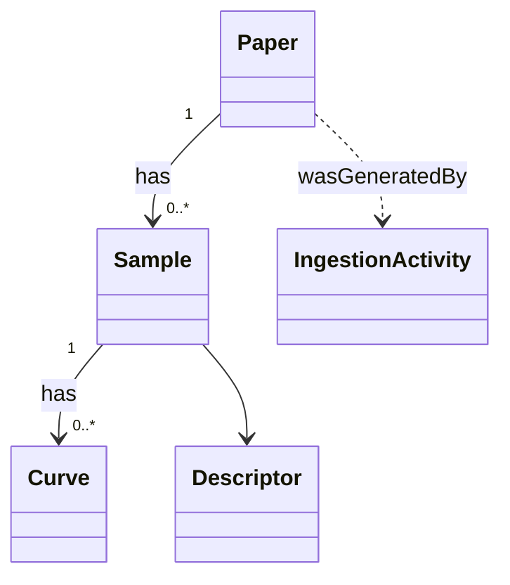

# AI-assisted Step 0 workflow

本ドキュメントは csv2rdf-mcp の **Step 0 = ontology / MIE / ingester の設計** を、AI agent (LLM) と人間が **対話的・視覚的に協働**して作るためのワークフローを retrospective に整理したものです。

Phase 1 (2026-05-27〜28) で starrydata 用の Step 0 アーティファクト一式 (TBox 153 triples / Mermaid 図 / MIE YAML 327 行 / Python ingester 600+ 行 / 32 pytest) を実際に AI と人間の co-design で作った経験を、再現可能なプロセスに抽出しています。Phase 3 で予定する **AI-assisted interactive ontology builder** の設計基盤となるドキュメントです。

---

## 0. 前提と目標

### 目標
- CSV (1 個または複数) から、その dataset を扱う最小限の RDF schema 一式 (TBox / Mermaid / MIE / ingester) を作る
- **人間がドメイン知識・設計判断**を握り、**AI が定型実装・全網羅・初期提案**を担う
- 完成した schema は (i) SPARQL で検索可能、(ii) AI agent から MCP 経由でアクセス可能、(iii) PROV-O で来歴追跡可能、を満たす

### 想定する人間の役割
- ドメイン専門家 (= dataset の意味を知っている人)
- ontology 設計を **ゼロから書く必要はない**が、提案を **批判的にレビュー**できる
- 「AI が間違いやすい点」(後述 §6) を知っていて、必要箇所で介入する

### 想定する AI の役割
- CSV の構造解析 (型推論、JSON 検出、列間関係)
- 既存設計パターン (PROV-O / schema.org / bibo / dcterms) からの type 引用
- TBox / MIE / Mermaid / Python の文法的に正しい生成
- 一貫性チェック (4 つのアーティファクト間で entity/property 名がズレないか)
- bug の根本原因分析 (例: collision バグの統計的検出)

---

## 1. ワークフロー全体図

```
┌──────────────────────────────────────────────────────────────┐
│  [1] CSV inspection (AI が単独で実行)                          │
│      - 列名・型・サンプル値                                   │
│      - JSON 埋め込み列の検出                                  │
│      - 列間関係 (foreign key) の推定                          │
│      - ID 列の uniqueness 統計 (★ 重要、§6 参照)             │
└────────────────┬─────────────────────────────────────────────┘
                 │
                 ▼
┌──────────────────────────────────────────────────────────────┐
│  [2] Domain context loading (人間 → AI)                       │
│      - データセットの主旨 ("starrydata: thermoelectric...")   │
│      - 既存 ontology 参照 (任意, 例: EMMO / schema.org)       │
│      - 設計制約 (任意, 例: PROV-O 必須 / sovereign)           │
│      - keyword / synonym (任意, 例: "熱起電力" = "Seebeck")   │
└────────────────┬─────────────────────────────────────────────┘
                 │
                 ▼
┌──────────────────────────────────────────────────────────────┐
│  [3] AI が初期 schema 提案 (視覚的に提示)                     │
│      - クラス候補 + プロパティ候補                            │
│      - IRI scheme (★ uniqueness を考慮)                       │
│      - 設計判断の根拠 (なぜ bnode じゃないか、等)             │
│      - Mermaid class diagram (即時 render)                    │
└────────────────┬─────────────────────────────────────────────┘
                 │
                 ▼
┌──────────────────────────────────────────────────────────────┐
│  [4] 人間が review & 指摘 (対話、ノード/エッジ単位で)         │
│      - 「Sample じゃなく Specimen に」                        │
│      - 「composition は Element の構造に」                    │
│      - 「QUDT IRI を使え」                                    │
│      - 「sample_id は globally unique?」                      │
└────────────────┬─────────────────────────────────────────────┘
                 │
                 ▼
┌──────────────────────────────────────────────────────────────┐
│  [5] AI が修正版を再生成 → [4] に戻る (収束まで反復)         │
└────────────────┬─────────────────────────────────────────────┘
                 │ 設計確定
                 ▼
┌──────────────────────────────────────────────────────────────┐
│  [6] AI が成果物 4 セット生成                                 │
│      - docs/ontology/starrydata.ttl (TBox)                    │
│      - docs/ontology/diagram.md (Mermaid)                     │
│      - data/togomcp/mie/{name}.yaml (MIE)                     │
│      - ingest/src/csv2rdf/{name}.py + tests/                  │
└────────────────┬─────────────────────────────────────────────┘
                 │
                 ▼
┌──────────────────────────────────────────────────────────────┐
│  [7] Validation (CI + 実 query)                                │
│      - pytest 全 pass                                         │
│      - ruff clean                                             │
│      - TTL parse OK                                           │
│      - subset を実 Oxigraph に投入 → SPARQL                   │
│      - 実 AI client (Dify) から MCP 経由検証 (★ §6 参照)     │
└──────────────────────────────────────────────────────────────┘
```

---

## 2. 各ステップの詳細

### Step 1: CSV inspection (AI 自動)

AI が CSV を読んで以下を出力 (1 query):

| Output | 内容 |
|---|---|
| 列構造 | name / 推定 type / non-null 率 / unique 値数 / sample 3 |
| JSON 検出 | 値が `[` または `{` で始まる列、内部スキーマの推定 |
| ID 候補 | unique 値率 100% の整数列 |
| 列間関係 | 別 CSV と column name / 値型が一致する列 (foreign key 候補) |
| **uniqueness 統計** | **ID 候補列の `(SID, X), (SID, Y, X)` 等の複合キーの uniqueness 検証** |

最後の **uniqueness 統計が決定的に重要**。Phase 1 で starrydata の `sample_id` / `figure_id` が globally unique でない事実 (9,661 / 4,466 件 collision) を Step 1 で発見できれば、Step 3 の IRI scheme が一発で正解できる。

**プロンプト雛形**:
```
CSV ファイル {path} を inspect して以下を返してください:
1. 列構造 (型推論、non-null 率、unique 値数、サンプル 3)
2. JSON 文字列を含む列があれば内部構造を解析
3. 別 CSV と参照関係がありそうな列を推定
4. ID 候補列について以下の uniqueness を確認:
   - 単独ユニーク?
   - もし複数 CSV あれば (foreign_key, this_id) 複合でユニーク?
   - すべての候補 IRI key について「複合がいくつあれば globally unique か」を表で
```

### Step 2: Domain context loading (人間 → AI)

人間が AI に渡す情報。長すぎる必要はないが **以下は必須**:

- データセット名 + 一文での目的 ("starrydata: 熱電・電池・磁性の論文から抽出した測定曲線データ")
- 主な利用シナリオ ("AI agent が natural language で composition / property を絞り込む")
- 既存 ontology の制約 ("PROV-O で来歴を持つこと")
- ドメインの synonym ("Seebeck = thermopower = 熱起電力", "Bi2Te3 は thermoelectric の代表格")

これは **MIE の `keywords` / `categories` に**直接反映される (Phase 1 で発覚した「AI が find_databases で見つけてくれない」問題を未然防止)。

### Step 3: AI が schema 提案

以下を **1 つの artifact set** として返す:

#### 3.1 クラス階層 (Mermaid 即出力)



人間が一目で entity 構造を見れる。

#### 3.2 IRI scheme

```
sd:   https://kumagallium.github.io/csv2rdf-mcp/{dataset}/ontology#
sdr:  https://kumagallium.github.io/csv2rdf-mcp/{dataset}/resource/

# Step 1 の uniqueness 統計に基づいた key
sdr:paper/{SID}
sdr:sample/{SID}-{sample_id}           ← 単独 sample_id は collide するから複合
sdr:curve/{SID}-{figure_id}-{sample_id} ← 三者複合でようやく unique
```

複合キーの **桁数判断は Step 1 の uniqueness 統計**から自動的に出る。

#### 3.3 設計判断の根拠

AI は提案と同時に「なぜそうしたか」を書く。例:

> **bnode 不使用**: Oxigraph の set semantics による re-ingest 冪等性を確保するため、Periodical / Descriptor / Person は IRI 命名 (`sdr:periodical/{slug}` 等)
>
> **curve x/y は方針 C (JSON literal + 集約値)**: 1 curve あたり 5-数百点、全体で数千万点規模になるため `sd:DataPoint` ノード化はストア肥大化リスクが大きい。集約値で粗い range 検索を支え、詳細は MCP ツールで配列展開する戦略

これがあれば人間が後から「なぜ?」を辿れる + Phase 2 で見直すときの判断材料になる。

#### 3.4 JSON 埋め込み列の扱い

AI は CSV inspection 結果から JSON 列をリストアップし、各列について戦略を提案:
- `author = "[{given,family},...]"` → Person ノードに展開 (cardinality `*`)
- `issued = "{date_parts:[[Y,M,D]]}"` → xsd:date literal 1 つに圧縮
- `x = "[300,400,...]"` → JSON literal + 集約 (Curve の方針 C)

### Step 4: 人間 review

review 観点 (chechklist):

| 観点 | 確認方法 |
|---|---|
| Class 名 / Property 名 | ドメイン的に自然か? Specimen vs Sample のような選択は妥当か? |
| **IRI uniqueness** | Step 1 の uniqueness 統計に信頼があるか (10 万行スケールで再検証する価値あり) |
| 既存 ontology との重複 | `schema:author` を使うべき場面で `sd:authoredBy` を新規作成していないか |
| Cardinality | "0..1" "0..*" "1..1" の選択が CSV の実態を反映しているか |
| JSON 列の戦略 | (展開 / literal / 集約) の選択がクエリ要件と合っているか |
| 主要 SPARQL クエリの shape | 「これを聞きたい」というクエリが提案された shape で書けるか |
| **Anti-patterns** | AI が含めた anti_patterns に「自分が嵌った罠」が含まれているか |

### Step 5: 反復

人間のコメントを受けて AI が修正版を再生成。**4 アーティファクト全部を同期して更新**するのが重要 (= AI なら容易、人間が手書きするとミスりがち)。

収束の sign:
- 人間が「もう問題ない」と言える
- 次の "実 query で検証" でも問題が出ない

### Step 6: 成果物 4 セット生成

最終的に出力されるファイル一式:

| ファイル | 役割 |
|---|---|
| `docs/ontology/{name}.ttl` | RDFS/OWL TBox、`rdfs:label`/`comment` en/ja、`rdfs:subClassOf` で既存 ontology に紐付け |
| `docs/ontology/diagram.md` | Mermaid class diagram (GitHub で render) |
| `data/togomcp/mie/{name}.yaml` | MIE YAML (AI への取扱説明書) — schema_info / shape_expressions / sample_rdf_entries / sparql_query_examples / cross_references / architectural_notes / data_statistics / anti_patterns / common_errors / categories / keywords |
| `ingest/src/csv2rdf/{name}.py` | CSV → Turtle 変換、utf-8-sig open、複合 IRI、PROV-O、JSON 列展開、error log |
| `ingest/tests/test_{name}.py` | pytest: bnode 不在 / IRI 形式 / 集約値 / **uniqueness 回帰** |
| `docs/starrydata/ontology/index.html` (Phase 1.5) | GitHub Pages 用 landing (IRI dereference 対応) |

### Step 7: Validation

CI (`.github/workflows/ci.yml`):
- ruff
- pytest
- TTL parse check
- E2E smoke test: subset → 実 Oxigraph → SPARQL → togomcp 経由クエリ

**そして必ず**: **実 AI client (Dify / Claude Code) で natural language 質問を投げて結果を観察**。期待と乖離があれば §6 の罠を疑う。

---

## 3. 一貫性ルール ("design triangle")

4 アーティファクト間の一貫性を維持するルール:

```
        TBox (TTL)
          │
          │ ── クラス・プロパティの正規定義
          │     (人間 + WebVOWL がレビュー)
          ▼
       Mermaid 図
          │
          │ ── 全体構造の視覚化
          │     (TBox の subset を図示、auto-gen 候補)
          ▼
        MIE YAML
          │
          │ ── AI への schema 取扱説明書
          │     (TBox のクラスを ShEx 形で表現 + 用例)
          │     ★ AI agent が runtime で読む唯一のファイル
          ▼
        Ingester (Python)
          │
          │ ── CSV → Turtle、TBox に準拠した triple を emit
          │     pytest で回帰防止
          ▼
       生成された Turtle
          │
          │ ── 実データが Oxigraph に投入される
          ▼
      実 AI が SPARQL クエリ
```

変更時は **必ず 4 ファイル同時更新**。AI に変更を頼むときも「TBox / MIE / ingester / test すべて」を明示する。

---

## 4. 視覚化フロー

Phase 1 で実装した 3 段階の可視化:

| Level | 入力 | ツール | レビュー目的 |
|---|---|---|---|
| 1 | Markdown | GitHub の Mermaid render | 全体把握 (1 分) |
| 2 | TBox TTL | Protégé / rdflib | 詳細レビュー (10 分) |
| 3 | TBox TTL の URL | [WebVOWL](https://service.tib.eu/webvowl/) | インタラクティブ円形図 (共有用) |
| 4 | live URL | GitHub Pages の landing | dereferenceable IRI として外部公開 |

Phase 3 で追加予定: ノード単位のコメント機能を持つ専用 UI (現在は Mermaid render に限界あり)。

---

## 5. ツールキット (Phase 1 時点)

実際に使ったもの:

| 役割 | ツール |
|---|---|
| TBox 生成 / parse | `rdflib` (Python) |
| Mermaid 検証 (local) | `npx @mermaid-js/mermaid-cli` |
| TTL 検証 | `rdflib` で parse pass |
| CSV inspection | `pandas` または `csv` module (BOM 対策に `utf-8-sig`) |
| 回帰テスト | `pytest` |
| Lint | `ruff` |
| MCP Client 検証 | `fastmcp.Client` + `StreamableHttpTransport` |
| 実 AI 検証 | Dify (production server, dify-server) |
| Ontology 公開 | GitHub Pages (静的 HTML + TTL) |

---

## 6. AI が間違いやすいポイント (Phase 1 で実観測)

**実際にこのプロジェクトで AI が起こしたミス**を列挙。Phase 3 で AI-assisted builder を作るときの validation logic に組み込むべき:

| # | AI が見落としがちな点 | Phase 1 での実害 | 検知方法 |
|---|---|---|---|
| 1 | **ID 列の globally-uniqueness 検証** | `sdr:sample/{sample_id}` の collision で 9,661 sample が collapse、Dify で誤データ出力 | Step 1 で `groupby + count` を必須化 |
| 2 | **CSV の BOM** | UTF-8 BOM 付き CSV を `utf-8` で開いて最初の列名が `"SID"` になり、参照が全滅 | `utf-8-sig` を default に + 最初の列名チェック |
| 3 | **bnode への安易な依存** | rdflib `BNode()` を使うと re-ingest 時に重複、Oxigraph が冪等にならない | TBox check で `rdfs:isDefinedBy IRI` 必須化 |
| 4 | **MIE の keywords / categories 欠落** | AI 自身が `find_databases("thermoelectric")` で starrydata を発見できず PubMed に逃げる | MIE template に keywords/categories セクションを必須化 |
| 5 | **Mermaid の colon escape** | `schema:author` がラベルにあると GitHub renderer が parse fail | renderer 互換性チェックを auto 化 |
| 6 | **fake sample_rdf_entries** | AI が架空の IRI を `sample_rdf_entries` に書きがち。実 IRI と乖離 | 実 CSV の 1 行を fixture として参照 |
| 7 | **architectural_notes の "なぜ" 欠落** | 設計判断の根拠が AI 自身の memory に閉じ込められて消失 | AI には毎回「なぜそうしたか」を併記させる |
| 8 | **AI 自身による hallucination** (実 query 結果) | Dify の AI が starrydata を見つけず PubMed の abstract から数値を fabricate | 実 SPARQL 結果と AI 出力を直接比較する E2E test |

これらが **Phase 3 の AI-assisted builder の必須 validator** になる。

---

## 7. 人間の必須介入ポイント (NEVER skip)

AI に任せてはいけない判断:

1. **IRI uniqueness の最終確認**: 全件 CSV で `groupby + count` を走らせて 0 collision を確認 (sample 100 件だけだと露呈しない)
2. **既存 ontology との alignment**: schema.org / EMMO / QUDT を **使うべき**箇所で新規プロパティを作っていないか
3. **License / 帰属**: 引用元データ (starrydata 等) の license と citation 要件
4. **実 AI agent との end-to-end 確認**: 人間が想定する natural language 質問を AI に投げて、AI が **正規データを使うか hallucinate するか**を直接観察
5. **Domain-specific synonym 補強**: AI が思いつかないドメイン用語 (例: 日本語 "熱起電力" を Seebeck の synonym に)

---

## 8. Phase 3 で目指す姿

このドキュメントは現状 **再現可能なプロセス**として書いてあるが、Phase 3 では **interactive tool** に進化させる予定:

1. **MCP tool 化**: `propose_schema(csv_path, domain_hint)` / `refine_schema(comment)` を csv2rdf-mcp に組み込み、Claude Code / Dify から AI session 内で呼べる
2. **LinkML / rdf-config 統合**: model.yaml 1 個から 4 アーティファクトを auto-gen (今の 4 ファイル同期問題を解消)
3. **視覚的レビュー UI**: ノード単位のコメント、エッジの drag、cardinality slider
4. **CI 統合**: PR で AI が schema 案を上げると、自動で TBox / Mermaid / MIE / ingester 雛形を `proposal/` ディレクトリに出して人間が手早くレビュー可能に

これは starrydata 以外の任意 dataset (Materials Project / NIMS Supercon / 一般 ELN data) を csv2rdf-mcp に取り込む **障壁を下げる**ことに直結する。

---

## 9. 関連

- [`option-b.md`](option-b.md) — 全体アーキ
- [`phase05-decisions.md`](phase05-decisions.md) — backend 採用判断
- [`../ontology/diagram.md`](../ontology/diagram.md) — 現行 Step 0 成果物の例
- [`../ontology/starrydata.ttl`](../ontology/starrydata.ttl) — 同上
- [`../../data/togomcp/mie/starrydata.yaml`](../../data/togomcp/mie/starrydata.yaml) — 同上
- [`../../ingest/src/csv2rdf/starrydata.py`](../../ingest/src/csv2rdf/starrydata.py) — 同上

---

**この workflow を試してフィードバックを残してください**: Phase 3 で MCP tool 化するとき、現状の人手プロセスのどこが「機械化できそう」「人間が必須」と感じたかを別 dataset で試して `docs/architecture/ai-assisted-step0-feedback.md` に追記する形で。
