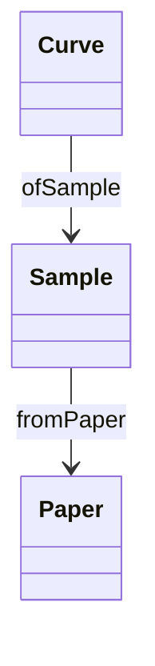

# Starrydata minimal fixture — diagram

Auto-generatable from `tbox.ttl`. Relation labels are colon-free (T5).

```mermaid
classDiagram
    class Paper
    class Sample
    class Curve
    Sample --> Paper : fromPaper
    Curve --> Sample : ofSample
```
